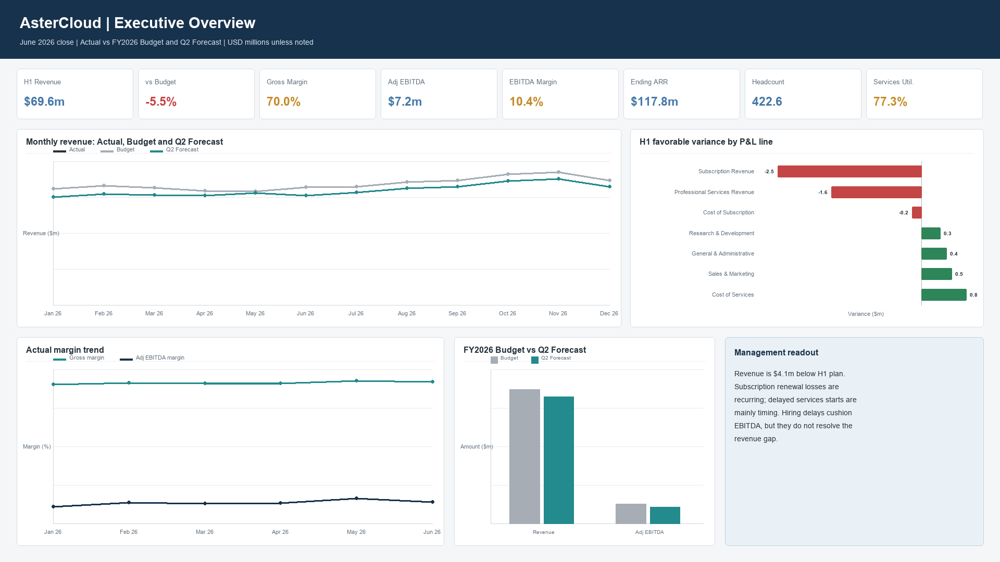
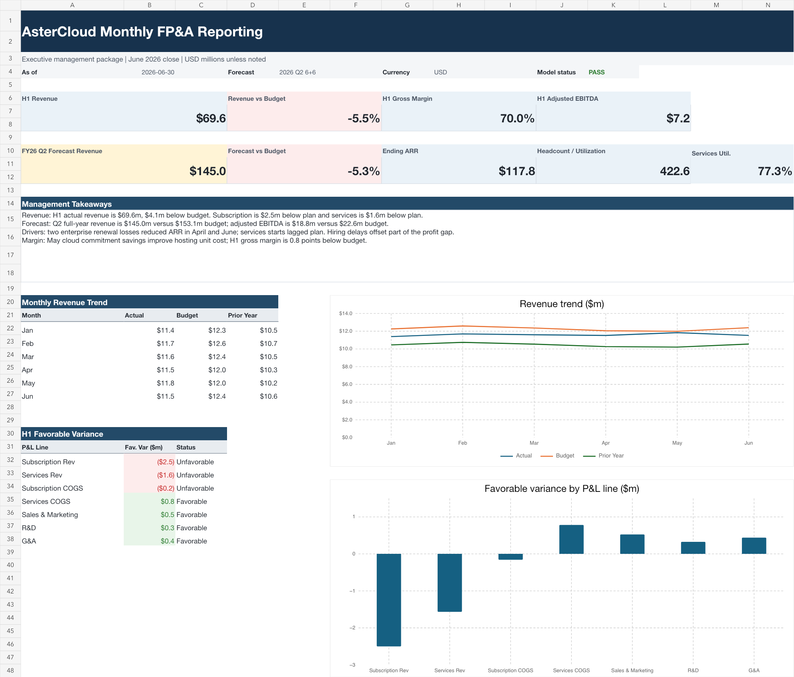

# AsterCloud Monthly FP&A Reporting

**Core analytics:** SQL (SQLite) | **Reporting:** Excel | **Visualization:** Tableau

An end-to-end FP&A portfolio project for a fictional North American B2B software company with two revenue streams: recurring SaaS subscriptions and professional services. The June 2026 reporting package compares actual performance with the FY2026 budget and Q2 full-year forecast.

> All customers, employees, projects, invoices, and transactions are synthetic. Public information is used only to calibrate realistic ranges and business rules. No real employer data is reproduced or disclosed.

## Project Deliverables

- [View the end-to-end SQL workflow](end_to_end_fpa_workflow.sql)
- [Download the Tableau dashboard](AsterCloud_FPA_Tableau_Dashboard.twbx)
- [Download the Excel management report](AsterCloud_FPA_Monthly_Report.xlsx)
- [Explore the source data](data/)

## Tableau Dashboard

The packaged Tableau workbook contains four management views:

1. **Executive Overview:** KPI snapshot, monthly revenue, H1 variance, margins, and full-year outlook.
2. **Revenue and ARR:** recurring revenue mix, ARR movement, segment mix, and customer concentration.
3. **Cost, Headcount and Services:** FTE, personnel cost, utilization, and project-margin exceptions.
4. **AR and Collections:** aging, regional exposure, past-due customers, and approximate DSO.

## Executive Snapshot

| Metric | Result |
|---|---:|
| FY2025 revenue | $130.5m |
| FY2025 revenue mix | 83.5% subscription / 16.5% services |
| H1 2026 actual revenue | $69.6m |
| H1 2026 revenue vs. budget | $(4.1)m unfavorable |
| H1 2026 adjusted EBITDA | $7.2m / 10.4% margin |
| FY2026 Q2 forecast revenue | $145.0m vs. $153.1m budget |
| June 2026 ending ARR | $117.8m |
| June 2026 headcount | 422.6 FTE |
| June 2026 services utilization | 77.3% |

## Management Findings

- H1 revenue finished $4.1m below budget, driven primarily by subscription renewal losses and delayed professional-services starts.
- Subscription losses represent a recurring revenue issue, while delayed services revenue is primarily timing-related.
- Hiring delays partially offset the EBITDA impact but do not resolve the underlying revenue gap.
- A May cloud-commitment renegotiation improved subscription unit cost and supported gross margin.
- Collection risk is concentrated among past-due customers and selected regional exposures.

## SQL Work Demonstrated

The [SQL workflow](end_to_end_fpa_workflow.sql) presents the analysis in the order used for a monthly FP&A review:

1. Inspect source tables, fields, row counts, and date coverage.
2. Test nulls, duplicates, primary keys, and foreign-key relationships.
3. Define the grain of actual, budget, forecast, ARR, headcount, utilization, project, and invoice tables.
4. Reconcile subscription revenue, project revenue, payroll, invoices, and planning periods.
5. Build reusable views for P&L reporting, ARR movement, variance analysis, service economics, and management KPIs.
6. Analyze performance gaps by revenue stream, region, customer segment, project, department, and account.

## Business Questions

1. Why is revenue below plan, and is the variance recurring or timing-related?
2. Which revenue stream, region, customer segment, and project explain the gap?
3. Is gross margin moving because of cloud unit cost, utilization, or revenue mix?
4. Are payroll and operating expenses favorable for healthy reasons?
5. What does the Q2 forecast imply for full-year revenue and adjusted EBITDA?
6. Where are collection risk and project-margin exceptions concentrated?

## Repository Contents

| File | Purpose |
|---|---|
| [`data/`](data/) | Synthetic source tables used in the analysis |
| [`end_to_end_fpa_workflow.sql`](end_to_end_fpa_workflow.sql) | Source audit, reconciliation, views, quality checks, and management analysis |
| [`AsterCloud_FPA_Monthly_Report.xlsx`](AsterCloud_FPA_Monthly_Report.xlsx) | Formula-driven Excel management reporting package |
| [`AsterCloud_FPA_Tableau_Dashboard.twbx`](AsterCloud_FPA_Tableau_Dashboard.twbx) | Packaged four-page Tableau dashboard |
| [`executive_overview.png`](executive_overview.png) | Tableau dashboard preview |
| [`executive_summary.png`](executive_summary.png) | Excel executive-summary preview |

## Important Conventions

- Currency is USD; Canadian compensation is expressed in USD-equivalent values.
- Revenue and expense facts are stored as positive presentation amounts; P&L views subtract costs and expenses from revenue.
- Adjusted EBITDA excludes depreciation and amortization and is used as a management metric rather than a GAAP subtotal.
- Actuals run from January 2023 through June 2026.
- FY2026 Budget covers January through December 2026.
- Q2 Forecast contains closed actuals for January through June and revised estimates for July through December.

## Portfolio Positioning

This project is designed for Corporate FP&A, Revenue Finance, GTM Finance, and Finance Analytics / BI roles. It emphasizes the work behind the dashboard: data validation, financial reconciliation, scenario versioning, variance logic, and business interpretation.
