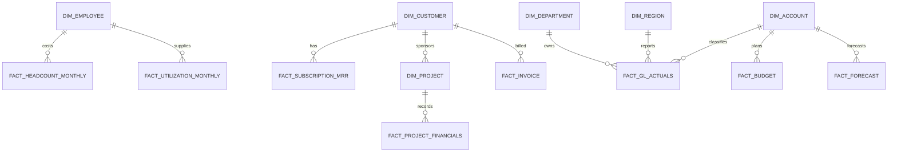

# AsterCloud Monthly FP&A Reporting

**Core analytics:** SQL (SQLite) | **Reporting:** Excel | **Visualization:**
Tableau-ready extracts | **Core analytics:** SQL (SQLite) | **Reporting:** Excel | **Visualization:** Tableau-ready datasets

An end-to-end FP&A portfolio project for a fictional North American B2B software
company with two revenue streams:

- recurring SaaS subscriptions;
- implementation, optimization, training, and managed services.

The reporting package closes June 2026 and compares actual performance with the
FY2026 budget and the Q2 full-year forecast. The project is designed to
demonstrate SQL, Tableau-ready data modeling, Excel reporting, variance analysis,
and management communication.

> All customers, employees, projects, invoices, and transactions are synthetic.
> Public information is used only to calibrate ranges and business rules. This
> dataset does not reproduce or disclose any real employer data.

## SQL work demonstrated

- Relational FP&A schema covering actuals, budget, forecast, customers,
  subscriptions, projects, invoices, headcount, and utilization.
- Reusable SQL views for P&L reporting, ARR movement, variance analysis,
  services economics, and management KPIs.
- Analysis queries that trace performance gaps by revenue stream, region,
  customer segment, project, department, and account.
- SQL quality checks for financial tie-outs, planning-period coverage, and
  referential integrity.
- SQL-generated flat extracts designed for Tableau consumption.

Start with [`end_to_end_fpa_workflow.sql`](end_to_end_fpa_workflow.sql), which covers source-data audit, financial reconciliation, analytical views, and management analysis.

## Executive snapshot

| Metric | Result |
| --- | ---: |
| FY2025 revenue | $130.5m |
| FY2025 revenue mix | 83.5% subscription / 16.5% services |
| H1 2026 actual revenue | $69.6m |
| H1 2026 revenue vs budget | $(4.1)m unfavorable |
| H1 2026 adjusted EBITDA | $7.2m / 10.4% margin |
| FY2026 Q2 forecast revenue | $145.0m vs $153.1m budget |
| June 2026 ending ARR | $117.8m |
| June 2026 headcount | 422.6 FTE |
| June 2026 services utilization | 77.3% |

The simulated operating story is intentionally imperfect. Two enterprise
renewal losses and delayed implementation starts create a revenue shortfall.
Hiring delays partially offset the EBITDA impact, while a May cloud commitment
renegotiation improves subscription unit cost.

## Management questions

1. Why is revenue below plan, and is the variance recurring or timing-related?
2. Which revenue stream, region, customer segment, and project explain the gap?
3. Is gross margin moving because of cloud unit cost, utilization, or mix?
4. Are payroll and operating expenses favorable for healthy reasons?
5. What does the Q2 forecast imply for full-year revenue and EBITDA?
6. Where are collection risk and project-margin exceptions concentrated?

## Deliverables

- [`end_to_end_fpa_workflow.sql`](end_to_end_fpa_workflow.sql): end-to-end SQL workflow covering source audit, data-quality checks, financial reconciliation, analytical views, and management analysis.
- [`data/database/astercloud_fpa.sqlite`](data/database/astercloud_fpa.sqlite): reusable SQLite database.
- [`data/csv/`](data/csv/): normalized source tables with stable IDs.
- [`data/tableau/`](data/tableau/): flat datasets prepared for Tableau.
- [`AsterCloud_FPA_Monthly_Report.xlsx`](AsterCloud_FPA_Monthly_Report.xlsx): formula-driven Excel management report.
- [`executive_summary.png`](executive_summary.png): executive-report preview.

## Why the data is realistic

The simulation uses four controls rather than unconstrained random numbers:

1. **Public anchors.** Workday informs subscription economics, retention,
   revenue recognition, and cost taxonomy. Globant informs services delivery
   economics. SaaS Capital provides a private B2B growth reference. BLS data
   informs compensation structure.
2. **Accounting relationships.** Subscription revenue is recognized over time;
   project revenue follows delivery; payroll rolls from employee-month records;
   invoices follow contract cadence and payment terms.
3. **Business events.** Churn, hiring delays, utilization softness, and cloud
   cost savings affect the relevant tables instead of being inserted only into a
   final dashboard.
4. **Reconciliation checks.** Subscription revenue, project revenue, payroll,
   invoices, planning periods, and referential integrity are tested in SQL.

The published dataset was generated with a fixed random seed (`20250725`) and is provided in both SQLite and CSV formats for consistent reuse.

## Public calibration sources

| Source | Used for |
| --- | --- |
| [Workday FY2025 Form 10-K](https://www.sec.gov/Archives/edgar/data/1327811/000132781125000056/wday-20250131.htm) | Subscription/services mix, retention, revenue recognition, cost categories |
| [Globant 2024 Form 20-F](https://www.sec.gov/Archives/edgar/data/1557860/000162828025009110/glob-20241231.htm) | Services gross-margin range and project accounting |
| [SaaS Capital 2025 growth benchmarks](https://www.saas-capital.com/research/private-saas-company-growth-rate-benchmarks/) | Private B2B SaaS growth range |
| [BLS employer compensation costs](https://www.bls.gov/news.release/archives/ecec_09122025.htm) | Benefits and compensation loading |
| [BLS industry wage estimates](https://www.bls.gov/oes/2024/may/oes_ind.htm) | Relative salary bands by job family |

The modeled company is not a scaled copy of any one source. It is a composite:
smaller than Workday, with a larger services mix and a profitable internal
delivery organization.

## Data model

The detailed model retains transaction-level customer and project keys for
actuals. Budget and forecast are stored at the management planning grain:
month, account, department, region, and business line.

## Review the project

1. Download `data/database/astercloud_fpa.sqlite`.
2. Open the database in DBeaver or another SQLite client.
3. Open `end_to_end_fpa_workflow.sql`.
4. Run the workflow section by section:
   - source-data audit;
   - financial reconciliation and quality checks;
   - analytical views;
   - management analysis.
5. Open `AsterCloud_FPA_Monthly_Report.xlsx` to review the final management reporting package.

## Important conventions

- Currency is USD; Canadian compensation is expressed in USD-equivalent values.
- Revenue and expense facts are stored as positive presentation amounts.
- P&L views subtract costs and expenses from revenue.
- `Adjusted EBITDA` excludes depreciation and amortization; it is a management
  metric, not a GAAP subtotal.
- Actuals run from January 2023 through June 2026.
- FY2026 Budget covers January-December 2026.
- Q2 Forecast contains closed actuals for January-June and revised estimates for
  July-December.

## Portfolio positioning

This repository is intended for Corporate FP&A, Revenue Finance, GTM Finance,
and Finance Analytics / BI roles. It emphasizes the work behind the dashboard:
mapping, reconciliation, scenario versioning, variance logic, and business
interpretation.
